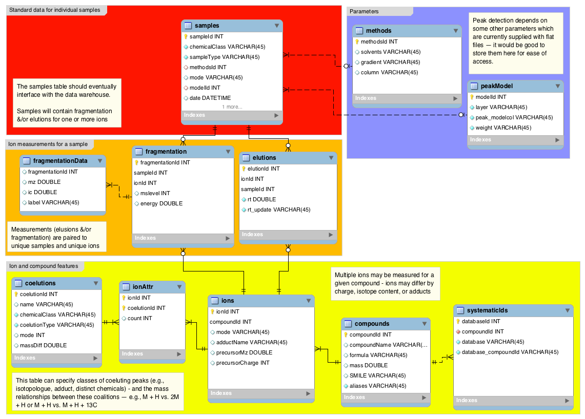
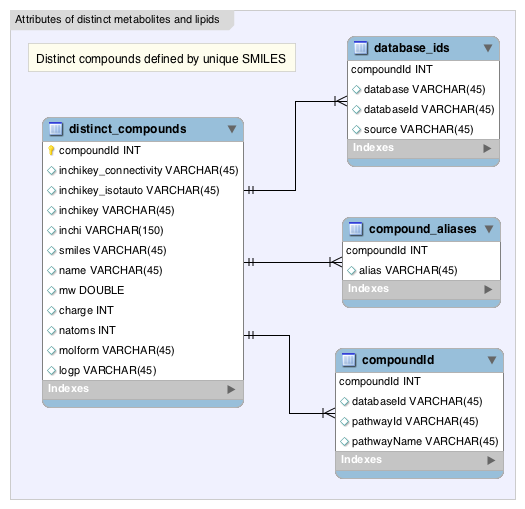
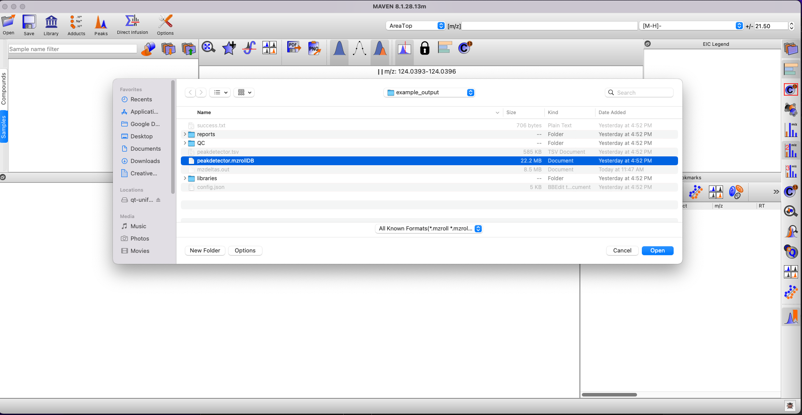
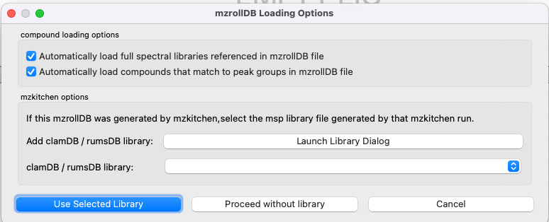
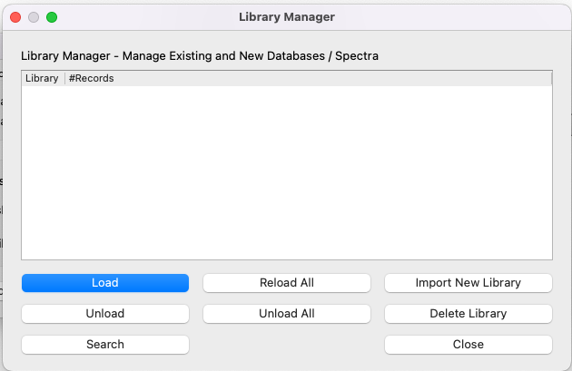
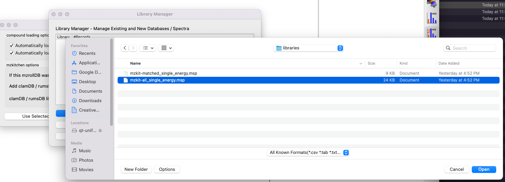
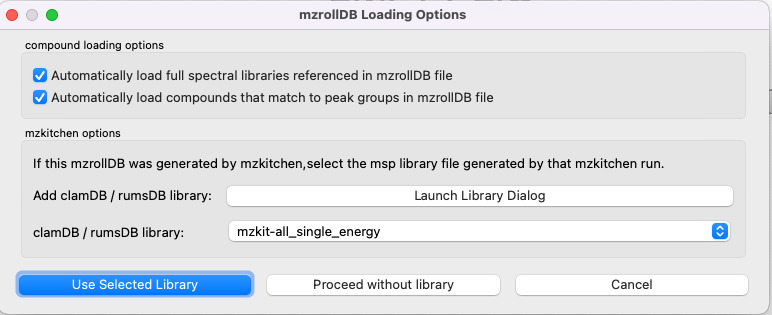
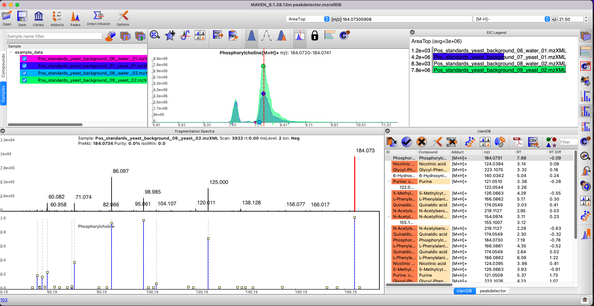

# open_CLaM Pipeline Example

The `open_CLaM` pipeline uses a series of C++ executables and R and python scripts.

To run this example, first ensure you are in the top-level `open_CLaM` directory, e.g.
```
cd <open_CLaM_parent_dir>/open_CLaM
```

The pipeline should be executed with three arguments:

`python mzkit.py -c <config_file> -d <data_folder> -o <output_folder>`

`<config_file>` is a `.json` file containing configuration information.
`<data_folder>` is a folder containing `.mzML` or `.mzXML` files.
`<output_folder>` is an empty folder where all output will be deposited.

To run this example, you can simply type

`python mzkit.py` 

by default, this example will be run.

# example_data

The example_data is a set of 4 mzXML files.
These are included in this repository, and will be downloaded onto your computer
if you followed the installation instructions.

# example_databases

The pipeline was originally designed to communicate with a MySQL database
containing elution and spectral information collected from chemical standards.

However, this same information may also be provided as a series of tables in `.rds` format.

In this example, we include an abbreviated databases as an `.rds` file.  This `.rds` files,
along with schema diagrams below, may be used to reconstruct the structure of the databases,
for those interested in creating their own MySQL database.

Schema for search database:


Schema for systematic compounds database:



# example_config

The configuration file is a `.json` file which contains all of the parameters needed to
execute the pipeline.

# example_output

Execution of the pipeline leads to depositing of files here.

the `peakdetector.mzrollDB` file is a SQLite database, which may be opened in
the desktop application program
[MAVEN](https://github.com/eugenemel/maven/releases/latest).

When you open a `peakdetector.mzrollDB` file in `MAVEN`, it will ask you about
associating a spectral library to the file.  You should follow the library dialog
to import the library generated in `libraries/mzkit-all_single_energy.msp`.

# Browing example_output: step-by-step guide

The results may be examined using the desktop application program
[MAVEN](https://github.com/eugenemel/maven/releases/latest).

Open MAVEN, and click on the **Open** button in the top left-hand corner of the
application window. 

1. In the file chooser that appears, select `peakdetector.mzrollDB` file from `example_output` folder.


2. In the loading dialog that appears, select **Launch Library Dialog**


3. Select **Import New Library** from the library dialog that appears.


4. Select **mzkit-all_single_energy.msp** from the file browser. This file is located at
```
<open_CLaM_parent_dir>/open_CLaM/open_CLaM_example/example_output/libraries/mzkit-all_single_energy.msp
```


Once the library is loaded, close the library dialog.

5. In the loading dialog, click **Use Selected Library**


6. Review your results using the [MAVEN GUI](https://github.com/eugenemel/maven/releases/latest)

